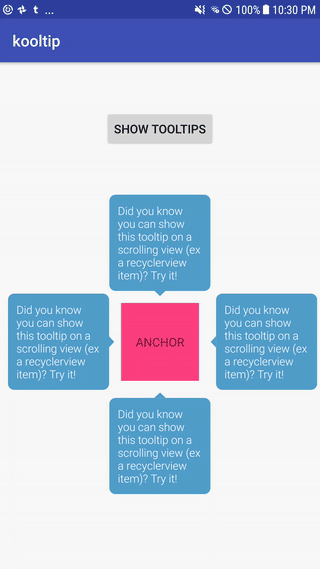

KoolTip
--------

Super simple tooltip library with a little levitating animation:
<br />



Why not just use a generic `PopupWindow`? Kooltip's main benefit is the ability to follow the anchor view if it scrolls (for example, when 
it is a recyclerview item) - while the usual `PopupWindow#showAsDropdown` is capable of this, it requires you to know your PopupWindow's 
width/height in advance to set offsets that won't cover the anchor view (attempts to `update` afterwards, alas, don't work with 
scrolling). Kooltip allows for `wrap-content` PopupWindows that auto-adjust to your desired gravity and track the anchor view as it scrolls.
 
### Usage

```kotlin
// create the tooltip
val tooltip = Kooltip.create(
		// required params
		contextRef = WeakReference(this),
		anchorViewRef = WeakReference(view), // view to anchor to
		contentText = text, // text to show (if no custom view)
		shouldShow = { true }, // predicate to determine when/whether to show
		
		// default config - customizations
		gravity = Gravity.TOP,
		durationTimeMs = DEFAULT_DURATION_TIME,
		dismissOnTouchOutside = false, // whether to dismiss on outside touch
		shouldHighlight = false, // whether to highlight the anchor view (TODO) 
		shouldAnimate = true, // whether to show the floating animation
		@ColorRes backgroundColorRes = R.color.default_tooltip_background,
		textColorRes = R.color.default_text_color,
		textAppearanceRes = R.style.default_text_appearance,
		
		// optional custom stuff
		listener = kooltipListener, // callbacks for on dismiss
		customView = null, // custom view for the popup window, overrides text view
		customAnimationStyle = null // custom animation, overrides default
)

// now show it
tooltip.show()

// optional listeners
private val kooltipListener: KooltipListener = object : KooltipListener {
        override fun onShow(tooltip: Kooltip) {
            /* tooltip shown */ 
        }

        override fun onDismiss(tooltip: Kooltip) { 
        	/* tooltip dismissed */ 
        }

        override fun onTapInside(tooltip: Kooltip) {
        	/* touched inside the tooltip - use to do a cta */
        }
    }
```